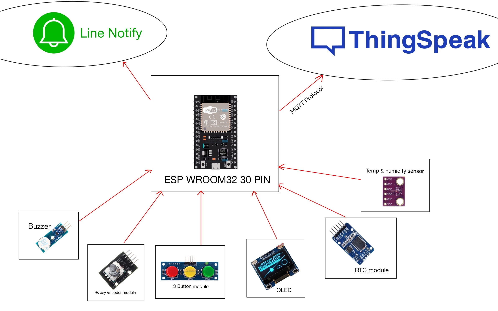
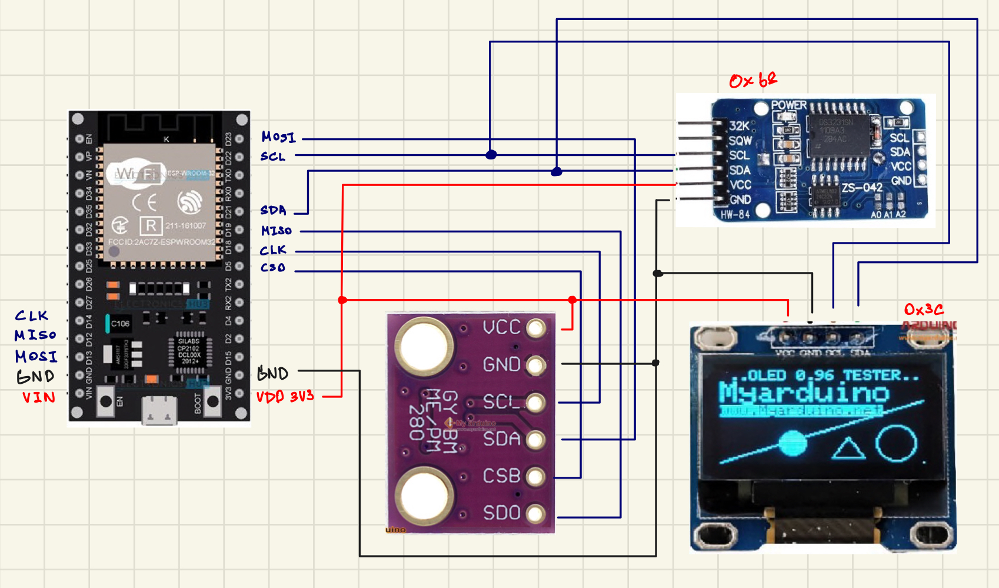

# Water Drinking Reminder

The project made to remind to drink water.
This project for Embedded Systems Design Laboratory.

## Requirements

- ESP-WROOM-32
- BME280 (SPI) for Temperature, Humidity
- DS3231 (I2C) for Real Time Clock
- SSD1306 (I2C) for OLED
- Buzzer module
- HW-040 for Rotary encoder module
- 3 Button module

## Design

## Schema

## Setup

1. Connect SSD1306 (I2C) to the ESP32.  
   VCC - 3V3  
   GND - GND  
   SCL - D22 (SCL)  
   SDA - D21 (SDA)  

2. Connect DS3231 (I2C) to the ESP32.  
   VCC - 3V3  
   GND - GND  
   SCL - D22 (SCL)  
   SDA - D21 (SDA)  

3. Connect BME280 (SPI) to the ESP32.  
   VCC - 3V3  
   GND - GND  
   SCL - D18  
   SDA - D23 (MOSI)  
   CSB - D5 (CS0)  
   SD0 - D19 (MISO)  

4. Connect Buzzer module to the ESP32.  
   VCC - 3V3  
   GND - GND  
   I/O - D13 (GPIO13)  

5. Connect 3 Button module to the ESP32.  
   VCC - 3V3  
   GND - GND  
   K1 - D34  
   K2 - D35  
   K3 - D32  

6. Connect HW-040 Rotary module to the ESP32.  
   "+" - 3V3  
   GND - GND  
   SW - D33  
   DT - D25  
   CLK - D26  

## Installation

1. Install library "Adafruit SSD1306 by Adafruit" for OLED

2. Install library "Adafruit GFX Library by Adafruit" for OLED

3. Install library "PubSubClient by Nick O'Leary" for MQTT Client

4. Install library "ArduinoJson by Benoit Blanchon" for using JSON serialization

5. Install library "TridentTD_Linenotify by TridentTD" for using LINE Notify

6. Install library "JC_Button by Jack Christensen" for debouncing signals.

7. Install library "RTClib by Adafruit" for setting current time

8. Install library "Adafruit BME280 Library by Adafruit" for using BME280

## Usage

1. Setup Thingspeak
   [Link Guide](https://app.tango.us/app/workflow/Setup-Water-Habit-Tracker-with-Thingspeak-using-MQTT-d4d8b49085ea492ab4a4902507486bd5)
2. Setup Line Message API service
   [Link Guide](https://app.tango.us/app/workflow/Line-Message-API-Bot-d784c38c28724f939111aaeadc92980f)

3. Setup Line Notify [Link Guide](https://app.tango.us/app/workflow/Setup-Line-Notify-376edee9e87d41818e2ef3297e6651a5)

## Troubleshooting

- Get text from line message API service but cannot send it to ESP32 (I try both MQTT and ThingHTTP)
