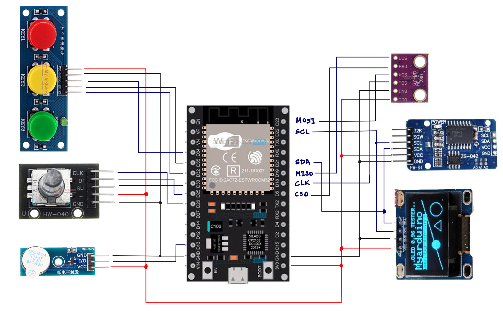

# Water Habit Tracker

The project made to remind to drink water.
This project for Embedded Systems Design Laboratory.

## Requirements

- ESP-WROOM-32
- BME280 (SPI) for Temperature, Humidity
- DS3231 (I2C) for Real Time Clock
- SSD1306 (I2C) for OLED

## Schema

## Setup

1. Connect SSD1306 to the ESP32.  
   VCC - 3V3  
   GND - GND  
   SCL - D22 (SCL)  
   SDA - D21 (SDA)  

## Installation

1. Install library "Adafruit SSD1306 by Adafruit" for OLED

2. Install library "Adafruit GFX Library by Adafruit" for OLED

3. Install library "PubSubClient by Nick O'Leary" for MQTT Client

## Usage

1. Setup Thingspeak
   https://app.tango.us/app/workflow/Setup-Water-Habit-Tracker-with-Thingspeak-using-MQTT-d4d8b49085ea492ab4a4902507486bd5

## Troubleshooting
